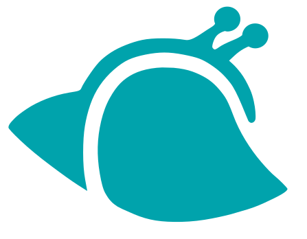
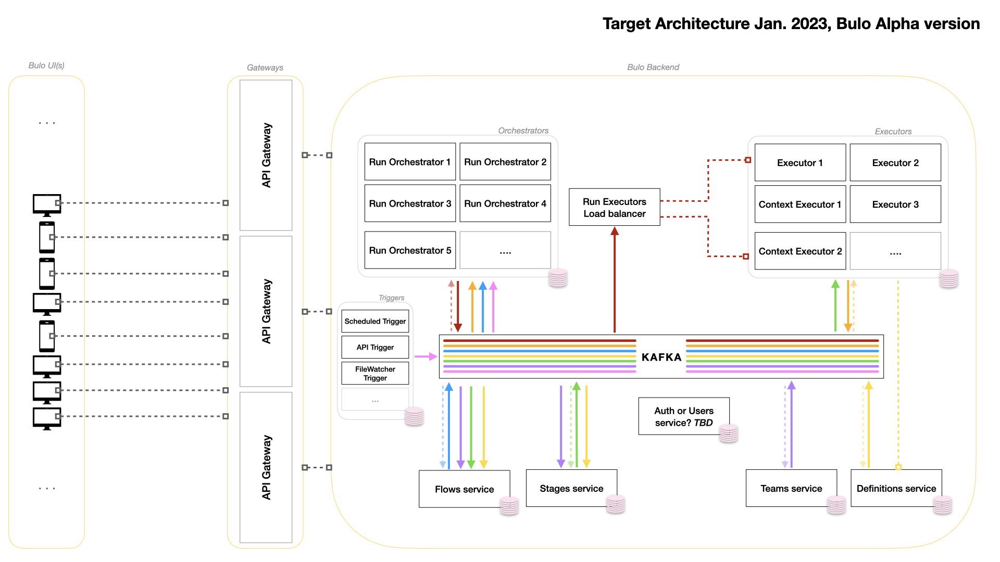

    
    <h1 class="title" style="margin-top:0" >Bulo Project (ALPHA version)</h1>  

## Seems you found your new automation buddy.

Bulo is a scalable solution to automate tasks at the organization level. The idea is to provide developers and business teams a unique platform to collaborate and achieve more, effortlessly. 
No more duplicate work, everything in Bulo is built so the community can share solutions and leverage on existing work. From the scale of a team, to the entire Bulo's community.
As scalability is at the core of its design, Bulo can stretch from a simple standalone Desktop App to an entreprise-scale, microservices application.
 
 

  
 
Thanks to the Bulo Store (Beta version), share and leverage on tools built by the community members, and automate your life is just a few clicks away!

## Which problems Bulo solves?  

At the scale of a large organisation, it's pretty common to find duplicated code and projects across the business units. How common is it to scrap top tweets per criteria for community managers? All Banks traders need to watch quotes from Bloomberg to operate, 
and I presume that I was not the only one who had to send a daily CSV report by mail during my intership. 

In theory, communication is seamlessly performed by the management team so duplicates are spotted and the workforce is used efficiently, no waste. In practice, Management role includes a bunch of responsibilities, which makes difficult if not impossible for executives to spend enough time on spotting inefficiencies.

**Bulo solves this** by providing a unique platform to gather all capacities built by your company's developers. No more duplicates, if you want to achieve something that _probably many people did before_, 
then just search for it on Bulo's store. With it's microservice architecture, Bulo is a scalable solution for your business to support any task that could be automated, and create wonderful tools that will help employees to focus on exciting and high-value, at any time.

Exclusively built in Java to achieve scalability up (microservices) and down (desktop standalone), Bulo aims to help business teams and developers to collaborate in an efficient fashion, so will together achieve more with less efforts. 
With exclusive features as Functional Stages, Flows inter-communications, and integration with multiple languages (Beta roadmap -> Python, Groovy, Java, and more in future versions) Bulo v1 is in the right position to bring your _digital transformation_ at the next level.  

## Why do we integrate a Standalone version? 

In the extent of the _open source_ philosophy, we strongly believe that automation should be accessible by everybody. A Standalone application makes it easy for any non-initiated user to test Bulo and access to all its wonderful features. A computer, an internet connection, and here we go!
Also, it makes it much easier for contributors to add functionalities as a microservice application is sometimes hard to run on a local machine. Finally, a business of 5 could not maintain a fancy infrastructure to support a microservices tool. For all these reasons, having a standalone version make sense.

And yet, we did not compromise on the microservices version' performances at runtime! The capability of Bulo to shrink down to a monolithic app is due to its code base architecture, designed from the beginning to separate domain logic and the technical components.

## Getting Started in 42 seconds  
_Java 16 required_. 

Bulo microservices and Standalone versions are not yet deployed in Alpha version. 
You can build the project and run it from your IDE, For how to run Bulo, please look at the [RUNME.md](docs/RUNME.md) page.

## Roadmap Alpha version - Jan 2023 

Find below the targeted architecture for End of Alpha version development. Only Bulo Backend would be included, Gateways and UI are here to understand in which runContext Bulo will  be used.  
More documentation (and current architecture) [here](docs/roadmap-alpha.md). 
For contributors, you can have a look on cards in [Bulo-Project's Dashboard](https://github.com/orgs/maukaim/projects/3) and pick one in the backlog.
 

Prioritized items (as of Feb 2023):
- [X] Add Mockingbird module (integration tests)
- [ ] Add Kafka integration
- [ ] Refactor, standardize modules coding style.
- [ ] Add Jenkins to start CI/CD pipeline.
- [ ] Add AWS integration.
- [ ] Add Dockers to universalize development.
- [ ] Refactor flaws in current MS Architecture (Orchestrator becomes FlowRun service + StageRun service, see [details here.](docs/Architecture_refacto_project.md))
- [ ] Add Plugin System for Java runners (Copy what exists in my other project, [Moula, module plugin-core](https://github.com/maukaim/prototype-moula-backend-api))
- [ ] Pluggable Logging system (Wrapper API on logback)

## How to contribute? 

Every one is welcomed ! From helping on the architecture design, building new Stage Runners or helping with documentation. If you are interested feel free to reach out ! julienelk@gmail.com 
To understand how to make your first contribution to the project, please read [CONTRIBUTE_ME.md](docs/CONTRIBUTEME.md)  

## Follow the project  

If you want to get notified on any news related to Bulo and you think this project is exciting,
you can [follow us on Medium](https://medium.com/@JulienElkaim), we will regularly post new articles about the project ideation and the implementation process!
