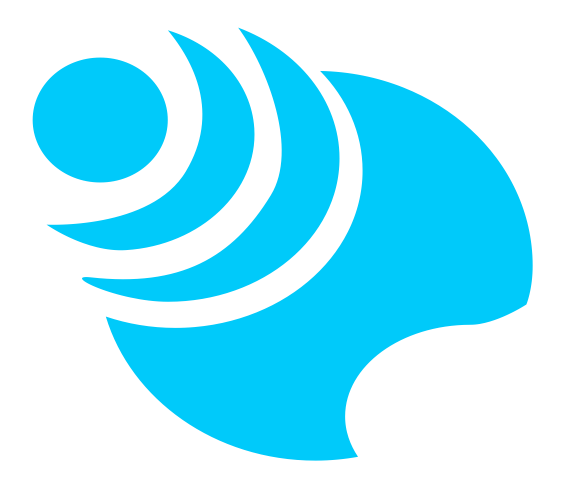

    
    <h1 class="title" >Bulo Project (ALPHA version).</h1>  

## Project Definition  

Bulo is a task automator aiming to provide a general purpose tool to easily automate tasks for individuals and organisations with a distributed architecture. 

Bulo is micro-service designed to be able to scale for any needs, from the user willing to manage automation of its IoT fleet, 
to the big company that wants a powerful tool able to automate the business required tasks and share common capabilities between teams.

## Follow the project  

As of July 2022: Bulo is not open to contributions yet, as I don't have the time to structure and manage PRs for the moment.

If you want to get notified on any news related to this project future features,
you can [follow me on Medium](https://medium.com/@JulienElkaim), I will regularly post new articles about the project ideation and the implementation process!

