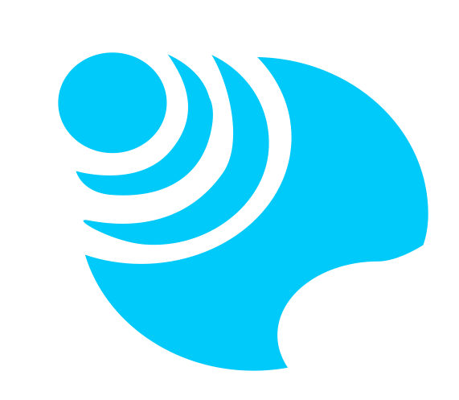

    
    <h1 class="title" >Bulo Project (ALPHA version)</h1>  

## It seems you just found a new automation buddy.

Bulo is a scalable solution to automate tasks at the organization level. The idea behind this project is to provide developers and business teams a unique platform to collaborate and bring value to the organization. 
No more duplicate work, everything here is built so the community can share solutions and leverage on existing work. From the scale of a team, to the entire Bulo's community.
As scalability is at the core of its design, Bulo can stretch from a simple standalone Desktop App to an entreprise-scale, microservices application. 

Thanks to the Bulo Store (Beta version), share and leverage on tools built by the community members, and automate your life within a few clicks!

## Follow the project  

As of July 2022: Bulo is not open to contributions yet, as I don't have the time to structure and manage PRs for the moment.

If you want to get notified on any news related to this project future features,
you can [follow me on Medium](https://medium.com/@JulienElkaim), I will regularly post new articles about the project ideation and the implementation process!
 
 

