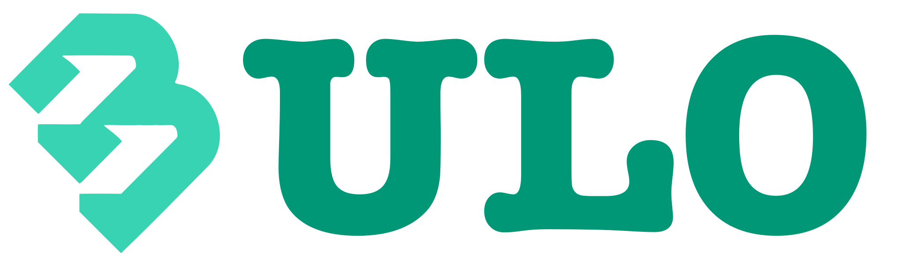

# About  

#### Solve Your Problem Once, Not Twice.

In a nutshell, Bulo Project is an open-source initiative to help companies automate their business. 
Built with Java and Flutter, it supports automating virtually anything, so that humans can spend their time doing things machines cannot.

# What to Use Bulo for and When to Use It   

Use Bulo to automate your workflows, so you can focus on what matters the most. Bulo is useful to:
- Automate simple to complex workflows.
- Create, Schedule & Send automated reports.
- Avoid redundancy within the organization by leveraging on existing bricks.
- React to your company's events in real-time, and trigger actions when it's needed.

Code it once, use it everywhere thanks to the _Stage system_. IT & Business teams can collaborate to Build, Schedule, Maintain and Enhance complex systems. 
Bulo is meant to reduce the SDLC and make it easier for small to large companies to automate the business.

# If We Had to Describe Bulo in just 4 Keywords  

- ### Collaborative
    Bulo is a tool for operational teams to automate their workflows, leveraging on *Stages* built by IT colleagues.  
By collaborating, they increase productivity and reduce time to market. All can manage, maintain and transform existing *Flows*.
- ### Reusable 
    Create a *Stage* once, and use it as many times as you want.  
With Bulo, users only need to build small technical bricks, and assemble them in to build complex behaviors, also reusable, and achieve their goals quicker.
- ### Scalable
    Thanks to its hyper-modular architecture, you can use Bulo in both standalone & microservice mode.
Test the functionalities on your PC to play around, or deploy the microservices to automate your business. Bulo will adapt to your needs!
- ### Customizable  
    The code structure of Bulo's Backend is designed to be easily customizable, nearly all services can be switched with your own implementations!
    Domain and App source code are well separated, which makes it very easy to migrate Bulo on your company-compliant framework if needed.
    Interfaces are extensively used to make it easy to substitute services and extend the app features based on your need.

# How to Start contributing to the Bulo Project

The [Wiki page "Get Started!"](https://github.com/maukaim/Bulo-Project/wiki/Get-Started) is here to help you to set up your environment and be dev-ready!  

Every one is welcomed to contribute! You may contact me, or go directly to the [Projects](https://github.com/maukaim/Bulo-Project/projects) tab to see all the projects and features that requires your help! Also visible in [Issues](https://github.com/maukaim/Bulo-Project/issues). An issue is not assigned? Means you can start working on it !  

Feel free to say _Hi!_ on [Linkedin](https://www.linkedin.com/in/elkaim-julien/) or via [mail](julienelk@gmail.com). 

# What comes next?  

**We are preparing Bulo BETA !**  

The features list for BETA version is still to be fixed. We will update this section once ready.

For a full picture, see the [Projects](https://github.com/maukaim/Bulo-Project/projects) or the [Issues](https://github.com/maukaim/Bulo-Project/issues) tabs in Github.
