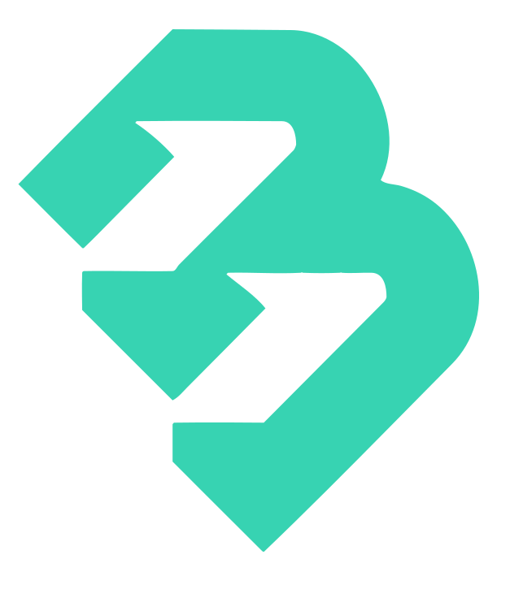

<div>
    <h1 class="title"> Bulo Automation Platform (ALPHA)</h1>  
</div>  
<br/>


**Bulo Platform is a solution for IT & Operational teams to collaborate and automate their business.**   

Create complexe workflows, increase your productivity and avoid coding 2 times the same feature in the same company.
Bulo is built as an Open Source Software under the MIT license, and has been designed to be flexible and customizable to fit all company size.

__*Alpha version. Fast iterations until release end 2023. Early joiners welcome, send me a message if you want to participate.*__

## Bulo in 4 points  

- ### Collaborative
    Bulo is a tool for operational teams to automate their workflows, leveraging on *Stages* built by IT colleagues.  
By collaborating, they increase productivity and reduce time to market. All can manage, maintain and transform existing *Flows*.
- ### Reusable 
    Create a *Stage* once, and use it as many times as you want.  
With Bulo, users only need to build small technical bricks, and assemble them in to build complex behaviors, also reusable, and achieve their goals quicker.
- ### Scalable
    Thanks to its hyper-modular architecture, you can use Bulo in both standalone & microservice mode.
Test the functionalities on your PC to play around, or deploy the microservices to automate your business. Bulo will adapt to your needs!
- ### Customizable  
    The code structure of Bulo's Backend is designed to be easily customizable, nearly all services can be switched with your own implementations!
    Domain and App source code are well separated, which makes it very easy to migrate Bulo on your company-compliant framework if needed.
    Interfaces are extensively used to make it easy to substitute services and extend the app features based on your need.


## Getting Started
As of June 2023, Bulo can run in Standalone (easier for a quick start) or in Microservices. 
Microservices are shaped to use Kafka (prod), but a kafka-less version exists for non production environment. By Default, in dev, services communicate with REST calls.

_Java 17 (LTS) required_. 

Copy the Java project on your local machine:
```shell
git clone git@github.com:maukaim/Bulo-Project.git
```  

You may already build the microservices with Uber-Jar. Run:
```shell
mvn clean install
```
and use java command line to launch the applications jar (all xxx-app modules). i.e:
```shell
java -jar application-standalone-1.0.0-SNAPSHOT.jar
```

Alternatively, the easiest solution is to use an IDE, it will discover all the apps available in the project and make it runnable for you.
- Standalone provides a turnkey jar. 
- For microservices, as of June 2023, only 1 requirement: launch Executor Service after any other service.

## Contributing

Every one is welcomed ! You can help on the architecture design, build a new Stage Runners or help with documentation. 
If you are interested feel free to reach out : julienelk@gmail.com 
To understand how to make your first contribution to the project, please read [CONTRIBUTE_ME.md](docs/CONTRIBUTEME.md)  


## Roadmap Alpha version - Start of 2023


**Feel free to contact me if you want to work on one of these projects.**
Prioritized items (as of Feb-March 2023):
- [X] Add Mockingbird module (integration tests)
- [X] Refactor, standardize modules coding style.
- [X] Add Kafka integration
- [X] Add Jenkins templates to kick-start CI/CD pipeline.
- [ ] Add Terraform template with AWS Provider.
- [ ] Add Dockers to universalize development.
- [ ] Refactor flaws in current MS Architecture (Orchestrator becomes FlowRun service + StageRun service, see [details here.](docs/Architecture_refacto_project.md))
- [ ] Add Plugin System for Java runners (Existing implementation in another Maukaim project, [Moula, module plugin-core](https://github.com/maukaim/prototype-moula-backend-api))
- [ ] Pluggable Logging system (Wrapper API on Logback)
- [ ] Add Plugin System for Python runners (++ User requirements.txt manager to setup venvs accordingly)

###
<br/>
<div align="center">

</div>  
<br/>
