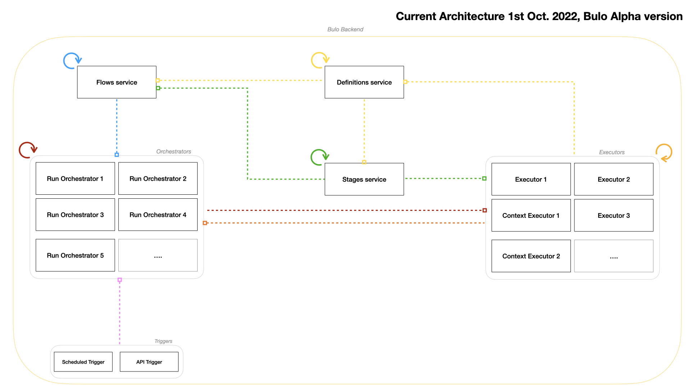

# ALPHA Version roadmap
___  

### Architecture
___

**As of 1st October 2022,** current project state is as following:  

  

**The targeted architecture**, at the end of the Alpha version will be:  

  

### Objectives
___  

Bulo Alpha's version should include persistency, Kafka components, and a few embedded Runners.  
Users should be able to create Functional Stages from the existing stages.  

Unfortunately, no UI will be included. We will probably use Flutter to reach as many devices as possible.  
Also, Authentication and Authorization will be included later, in Beta version. As will the store be.  

The Alpha version should already include scale up/down from microservices arch to standalone app. Each MS should suport multiple instances running at the same time.
A load balancer should make the interface between Executors and Kafka, to send the stage run events to the relevant Executor.  
Also, contextual Executors should already have a 1st implementation (means, an executor which is able to interact with the server's file system, is aware of the machine it runs on.).

With a vision less technical, Bulo should be already useful and scalable. Anyone testing it should feel it easy to add Runners and automate its simple tasks.